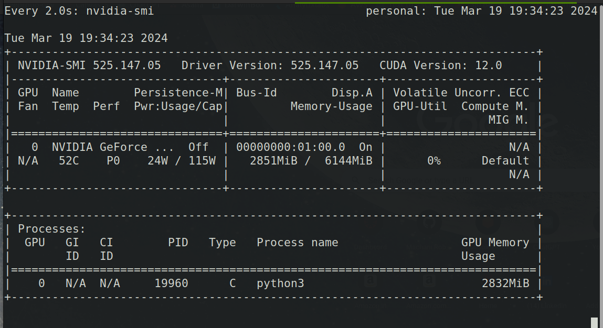

<div align="center">

# distil-whisper-live
[](https://github.com/pre-commit/pre-commit)
[](https://pytorch.org/get-started/locally/)


A clean and simple PyTorch implementation of distil whisper speech to text in live mode.

</div>

## 📌 Introduction

This repository contains a clean and simple pytorch implementation of distil whisper speech to text taking live input from the microphone. In config we can provide required mic details for our code to work. The code is written in a modular way so that it can be easily understood and modified. The code is written in a way that it can be easily integrated with other projects. Also once the text prediction is done, it is sent to redis server for further processing using redis pub sub communication.

## 📜 Feature

- [x] Live Speech to Text
- [x] Redis Pub Sub Communication
- [x] Modular Code
- [x] Easy to Integrate

## 📁  Project Structure
The directory structure of new project looks like this:
    
```

├── configs
│   └── config.toml
├── internal
│   ├── app.py
│   ├── core
│   │   ├── audio_src.py
│   │   ├── __init__.py
│   │   └── stt.py
│   ├── __init__.py
│   ├── server
│   │   ├── __init__.py
│   │   └── pubsub.py
│   └── utils
│       ├── config.py
│       ├── __init__.py
│       ├── logger.py
│       ├── models.py
│       ├── noise_check.py
│       ├── textformat.py
│       └── util.py
├── logs
│   └── server.log
├── main.py
├── pylogger
│   ├── __init__.py
│   └── logger.py
├── README.md
└── requirements.txt

```

## 🚀 Getting Started

### Step 1: Clone the repository

```bash
git clone https://github.com/sh-aidev/distil-whisper.git
cd distil-whisper
```

### Step 2: Open inside docker container in vscode

```bash
code .
```
**NOTE**: Once repo in opened in vscode, it will ask to open in container. Click on reopen in container. It will take some time to build the container.

### Step 3: Install the required dependencies

```bash
python3 -m pip install -r requirements.txt
```

### Step 4: Get the Name of the Microphone

```bash
python3 get_source_mic.py
```
Which ever Mic you want to select, copy the name of that mic and paste it in config.toml file.

`NOTE`: If you are using docker, you need to run the above command inside the docker container. If your desired mic is not listed, try restarting system and then run the command. Also, to get the mic sample rate, you can run the below command in the terminal and updated the sample rate in config.toml file respectively.

```bash
pactl list sources | grep -A 10 alsa_input
```

### Step 5: Run the code

```bash
python3 main.py

# NOTE: If you are running the code for the first time, make sure to correctly provide mic details in config.toml file like name, sample rate, etc.

# Also, it is possible that noise threshold for you mic could be different. So, you can play around with the value to get the best result.
```

## ⚡️ GPU Memory Stats



## 📜  References

- [Distil-Whisper](https://github.com/huggingface/distil-whisper)
- [PyTorch](https://pytorch.org/)
- [Redis](https://redis.io/)
- [Docker](https://www.docker.com/)
